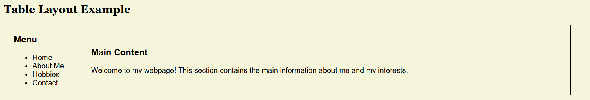

# Assignment 1 - HTML & CSS Basics

**Name:** Aknur  
**Group:** IT-2501  
**Course:** Web Technologies 1 - Frontend

## Introduction

For this assignment, I created a simple personal webpage using HTML and CSS. 
The main goal was to practice the basic HTML structure first and then use CSS 
to improve the appearance and layout of the webpage.

#

## Part 1 - Introduction to HTML

### Step 0 - Basic HTML Structure

I created an `index.html` file and added the basic HTML structure with 
`<!DOCTYPE html>`, `<html>`, `<head>`, and `<body>` elements. I also added 
the page title "My First Webpage".

### Step 1 - Text Structure

I added different heading levels and paragraphs to organize the information 
on my webpage. The page includes my name, group, course, and a short 
introduction about myself.

### Step 2 - HTML Lists

Here I created two types of lists. An ordered list is used for my hobbies, while 
an unordered list is used for my favourite websites.

### Step 3 - Images and Links

I added my photo to the webpage using the `` tag and included alternative 
text for the image. I also added two clickable links to useful websites.

### Step 4 - HTML Button

On this step I added a simple "Click Me" button using the `<button>` element. This helped 
me practice adding interactive-looking elements to an HTML page.

**Screenshot of Part 1:**

---

## Part 2 - Intermediate HTML

### Step 5 - HTML Table

I created a weekly class schedule with three columns: Subject, Day, and Time. 
I used table rows and cells to organize my university schedule.

I also used `rowspan` to combine the days when there are two classes on the 
same day.

### Step 6 - Table Layout

I created a simple two-column table layout. The first column contains a Menu, 
and the second column contains the Main Content. This helped me understand 
how tables can be used to organize content into different sections.

### Step 7 - Unicode Character References

I added three emojis using Unicode character references instead of directly 
writing the emoji characters. They are included in a short paragraph about 
my mood today.

### Step 8 - HTML Form

I created a contact form with fields for Name, Email, Favorite Color, and a 
Submit button. This gave me practice working with labels, inputs, and forms.

---

## Part 3 - Introduction to CSS

### Step 9 - Introduction to CSS

I created a separate `style.css` file and connected it to my HTML page. 
I used CSS to change the font, background color, text size, spacing, and 
other visual properties.

### Step 10 - Inline CSS

I used inline CSS on some paragraphs to change their text color. This helped 
me understand how CSS can be applied directly to an HTML element.

### Step 11 - Internal CSS

I added a `<style>` section inside the `<head>` of the HTML document. 
For example, I used it to change the font of the `h2` headings.

### Step 12 - External CSS

I connected my external `style.css` file using the `<link>` element. Most 
of the styling of the webpage is done in this separate CSS file.

### Step 13 - CSS Selectors

I practiced using different types of CSS selectors, including element 
selectors, class selectors, and ID selectors.

### Step 14 - Classes and IDs

I used the `.highlight` class for highlighted paragraphs and the 
`#main-heading` ID for the main heading. This helped me understand the 
difference between reusable classes and unique IDs.

**Screenshot of Part 3:**

---

## Part 4 - Intermediate CSS

### Step 15 - Favicon

I added a favicon to my webpage using a PNG image. The favicon appears in 
the browser tab when the webpage is opened.

### Step 16 - HTML Divs

I used `
` elements to divide the webpage into different sections, 
including the header, main content, and footer.

### Step 17 - CSS Box Model

I practiced the CSS box model by using `margin`, `border`, and `padding`. 
I applied these properties to my weekly schedule table to control its 
spacing and borders.

### Step 18 - CSS Positioning

I demonstrated three types of positioning: static, relative, and absolute. 
I created separate examples on the page so that the difference between 
these positioning types can be seen.

### Step 19 - CSS Sizing

I used different CSS sizing units: `px`, `%`, `em`, and `rem`. For example, 
I used these units for text sizes and the width of the image.

### Step 20 - Float and Clear

I created two blocks using `float: left` and `float: right`. I then used 
`clear: both` so that the paragraph after them appears below the floated 
elements.

## Step 21 - GitHub and GitHub Pages

After finishing the webpage, I created a public GitHub repository and 
uploaded all the project files.

then I used GitHub Pages to publish the website online.

**GitHub Repository:**  
https://github.com/aknur-g/assignment1-frontend

**Live Website:**  
https://aknur-g.github.io/assignment1-frontend/

## Conclusion

Overall, this assignment gave me practical experience with the basic 
HTML and CSS concepts from the course. Now I have a better understanding 
of how to structure a webpage, style its elements, and organize a small 
frontend project.
